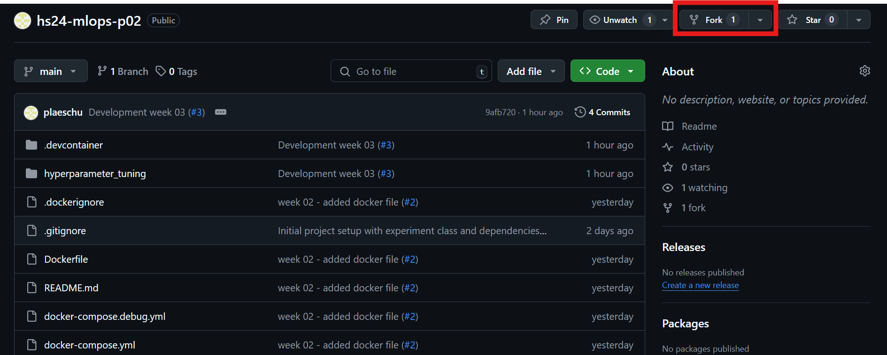
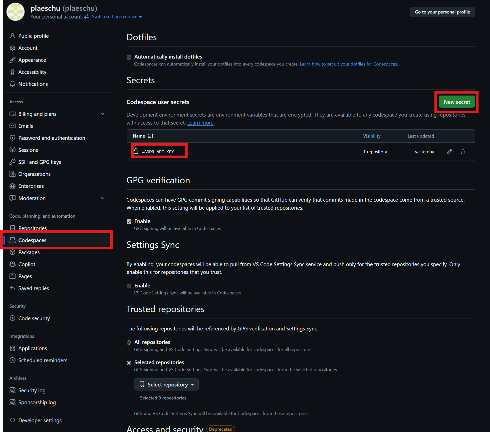
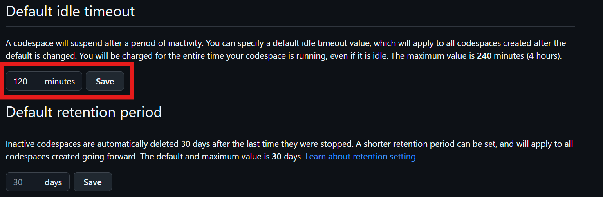
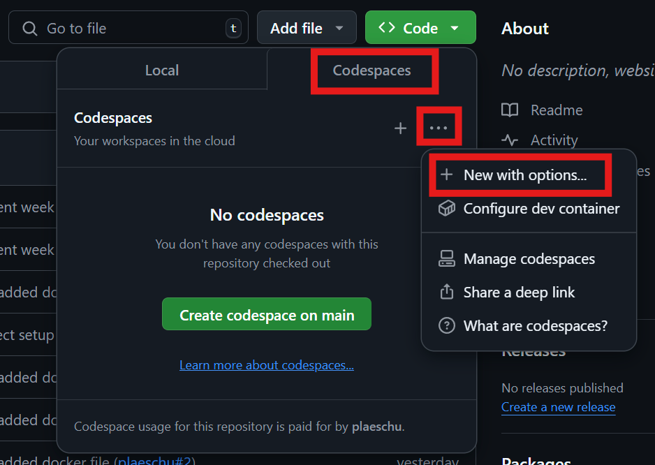
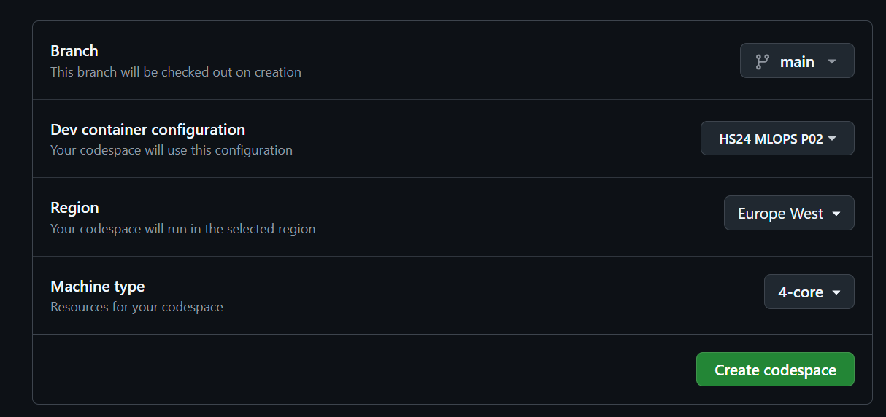
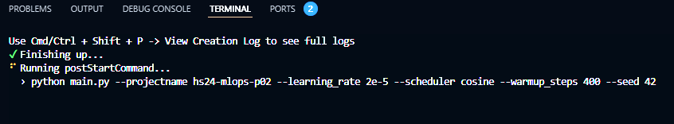

# HS24 MLOPS Project 02
Author: Pascal Gansner

## Overview
This project was created during project two for the MLOPS course. The goal of this project is to run a training run inside a Docker container on the local machine and on a hosted platform, e.g. GitHub Codespaces.

This file guides you how to build and run the container either on your local machine or on the codespaces.

## Prerequisites
The only thing that is neccessary to run the training either on codespaces or on your local machine is a **Wandb API key**. The Python script is set to have the run logged with the tracking tool Wandb. You can't run a training without an API key. Some general understanding of Python does help to understand the Python script which is used.

The `main.py` script accepts several arguments to configure the hyperparameters. Here are the available arguments:

- `--projectname`: Name of the project (default: `glue_hyperparameter_tuning`)
- `--model_name_or_path`: Model name or path (default: `bert-base-uncased`)
- `--task_name`: Name of the task (default: `mrpc`)
- `--max_seq_length`: Maximum sequence length (default: `128`)
- `--batch_size`: Batch size (default: `32`)
- `--learning_rate`: Learning rate (default: `2e-5`)
- `--weight_decay`: Weight decay (default: `0.0`)
- `--scheduler`: Scheduler type (default: `linear`)
- `--warmup_steps`: Number of warmup steps (default: `0`)
- `--optimizer`: Optimizer type (default: `adamw`)
- `--epochs`: Number of epochs (default: `3`)
- `--seed`: Seed for reproducibility (default: `None`)
- `--checkpoint_dir`: Directory to save checkpoints (default: `checkpoints`)

To run the script with custom arguments, you can use the following command:

```sh
python main.py --projectname my_project --learning_rate 3e-5 --scheduler cosine
```
## Guide to Run Locally
To build and run the Docker container on your local machine you must have **Docker installed**. To speed things up considerably, you should also consider installing NVIDIA Cuda support, if you have a graphics card available.

1. Clone the repository 
```
git clone https://github.com/plaeschu/hs24-mlops-p02.git
```
2. Build the Docker container
```sh
docker build -t hs24mlopsp02 .
```
3. Run the Docker container
```sh
docker run --rm --gpus all --env WANDB_API_KEY=key hs24mlopsp02 --args
``` 
- ``--rm`` automatically removes the container at the end of the run.
- ``--gpu all`` gives the container the ability to use your graphics card for training.
- ``--mount type=bind,source=/c/Users/pasca/source/repos/hslu/hs24-mlops-p02/checkpoints,target=/app/checkpoints`` optionally mount the checkpoints folder with your host machine to save the checkpoint outside of the Docker container.
- ``--env WANDB_API_KEY=key`` set the environment variable with the wandb api key to perform the login.
- ``--args`` has to be replaced with any available argument for example the ``learning_rate`` and ``warmup_steps``.

## Guide to Run on Codespaces
The second option to run the container is on Codespaces. As the available performance is limited the training run does take quite some time on Codespaces. The important file to run the container on Codespaces is the  [devcontainer.json](./\.devcontainer/devcontainer.json). This file customises the devcontainer. 

1. Fork the [repository](https://github.com/plaeschu/hs24-mlops-p02.git)\

1. Configure the Wandb API Key\

1. Configure idle timeout because the training run takes a while\

1. Configure the Codespaces container\

1. Build the Codespaces container\

1. After building the container it automatically starts the training run with some predefined hyperparameters. They can be adapted in the ``postStartCommand``. This command is run every time the container is started, even if the container is started from idle.\

